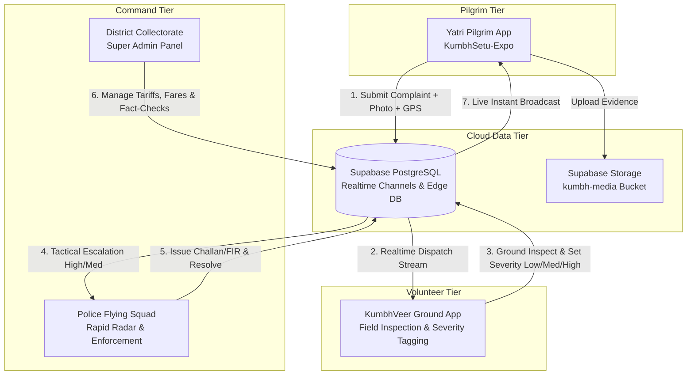

# 🕉️ KumbhSetu: Complete Technical Architecture & System Documentation
### *Next-Generation Smart Governance, Pilgrim Safety & Fair-Price Marketplace Platform for Nashik-Trimbakeshwar Kumbh Mela 2027*

---

## 1. Executive Summary & Vision

**KumbhSetu** is an enterprise-grade, tri-application ecosystem engineered specifically for the world's largest religious gathering — the **Nashik-Trimbakeshwar Simhastha Kumbh Mela 2027**. With over **100+ million expected pilgrims (Yatris)**, the challenges of crowd control, anti-extortion enforcement, fake news containment, transit fair pricing, and volunteer dispatch require a synchronized, offline-resilient, real-time command platform.

### The Core Problem Matrix:
1. **Transit & Merchant Price Extortion**: Pilgrims, especially elderly and rural travelers, are frequently subjected to 3x–5x inflated auto/taxi fares and exorbitant prices for food and puja samagri.
2. **Crowd Density & Delayed First Response**: Traditional emergency reporting takes 25–45 minutes to reach ground teams due to network congestion and vague manual location sharing.
3. **Misinformation & Panic Cascades**: Unchecked rumors regarding stampedes, bridge collapses, or ghat closures create catastrophic crowd stampede risks.
4. **Coordination Gap**: Lack of unified coordination between **Pilgrims (Yatris)**, **Ground Volunteers (KumbhVeer)**, **Mela Police Squads**, and the **District Collectorate Administration**.

### The KumbhSetu Solution:
KumbhSetu unifies all stakeholders into a cohesive digital network comprising:
- **KumbhSetu-Expo (Pilgrim Super App)**: Multi-lingual (Hindi, Marathi, Gujarati, English), fare calculators, real-time GPS complaint logging with photo evidence, emergency SOS, verified local bazaar, and Shahi Snan live muhurat schedules.
- **KumbhVeer (Volunteer Ground Verification App)**: Rapid physical inspection of reported incidents, 3-stage severity validation (Low, Medium, High), crowd density sensing, and SOS field triage.
- **KumbhSetu-Admins (Command & Control Desktop/Web App)**: Tactical Police Radar, Challan & Fine enforcement desk, dynamic tariff cap engine, official Fact-Check Rumor Buster, and bazaar merchant verification.

---

## 2. Ecosystem Architecture



---

## 3. The Three Applications

### 3.1. KumbhSetu-Expo (Pilgrim Application)
- **Target Users**: Millions of visiting pilgrims, sadhus, families, and international tourists.
- **Key Features**:
  - **4-Language Localization**: Instant switching between Hindi (हिन्दी), Marathi (मराठी), Gujarati (ગુજરાતી), and English with native cultural phrasing.
  - **Dynamic Transit Fare Calculator**: Live government-approved RTO auto, taxi, e-rickshaw, and bus tariff tables with distance-based price caps to eliminate extortion.
  - **1-Tap Anti-Extortion & Safety Reporting**: Allows yatris to capture vendor photos, lock high-precision GPS coordinates, and file reports with instant case token IDs (`KS-RTO-XXXXXX`).
  - **Report Self-Management**: Yatris can track their filed cases in real-time, view volunteer verification severity badges, and withdraw/delete reports once resolved.
  - **Fact-Check Rumor Buster**: Real-time counter-misinformation feed directly debunked by District Administration.
  - **Verified Kumbh Bazaar**: Directory of government-registered, FSSAI-certified food stalls, puja samagri stores, and dharamshalas with official price ceilings.
  - **Shahi Snan Muhurat Countdown**: Live auspicious bath timers for Ramkund, Kushavarta, and Tapovan Ghats.
  - **24x7 Emergency SOS**: One-touch speed dialing for Police (112), Medical Emergency (108), Disaster Management, and Women Helpline.

### 3.2. KumbhVeer (Volunteer Ground App)
- **Target Users**: On-duty NCC, NSS, scouts, and civil defense volunteers patrolling sectors.
- **Key Features**:
  - **Real-Time Incident Stream**: Immediate vibration/alert when a pilgrim submits a grievance in the volunteer's assigned sector.
  - **3-Stage Severity Tagging**: Ground inspection triage tagging incidents as:
    - 🟢 **LOW**: Minor discrepancy (informally resolved or non-critical).
    - 🟡 **MED**: Confirmed overcharging or unauthorized stall setup.
    - 🔴 **HIGH**: Physical extortion, mob harassment, emergency blockade, or safety hazard.
  - **Tactical GPS Route Navigation**: Integrated 1-tap Google Maps directions directly to the pilgrim's reported spot.
  - **Direct Pilgrim Call**: One-tap phone connection to verify location details.

### 3.3. KumbhSetu-Admins (Police & Administrative Command Center)
- **Target Users**: Nashik City & Rural Police, RTO Flying Squads, District Magistrate, Municipal Corporation.
- **Platform**: Cross-platform Web application & Standalone Windows Desktop Software (`KumbhSetu Admins.exe`).
- **Key Features**:
  - **1-Click Role-Based Authentication**:
    - 👮 **Police Flying Squad** (`Police123` / `pols123`): Dedicated Tactical Radar view.
    - 🏛️ **Collector Super Admin** (`Gaurang` / `pass123`): Complete administrative controls.
  - **Police Rapid Enforcement Radar**:
    - Sleek 3-column live metric bar (`🚨 High Priority | ⚠️ Medium Watch | ✅ Resolved`).
    - Full-screen unified scroll stream with 150px prominent photo evidence banners.
    - Full-resolution photo inspection modal.
    - Quick-fine challan executor (₹500 / ₹1,000 / ₹2,000 / ₹5,000), FIR registration, license suspension, or formal warnings.
  - **Tariff & Commodity Management**: Real-time CRUD price ceiling controls for 50+ transit routes and staple goods (milk, water bottles, prasad, lodging).
  - **Rumor Buster Dispatcher**: 1-click verification of citizen claims with official explanation broadcasts.
  - **Merchant Bazaar Verification**: Approving or revoking local vendor licenses and FSSAI compliance certificates.
  - **1-Tap Test Data Purge**: Complete administrative control to delete test reports or clear records.

---

## 4. Database Schema & Supabase Architecture

The database is built on PostgreSQL hosted via Supabase with Row Level Security (RLS) and WebSocket Realtime replication.

### 4.1. `incidents_and_grievances`
| Column | Type | Description |
|---|---|---|
| `id` | `UUID` (PK) | Unique incident ID |
| `title` | `TEXT` | Summary (e.g. `Overcharging: Auto MH-15-AB-1234`) |
| `description` | `TEXT` | Detailed pilgrim narrative & rates |
| `category` | `TEXT` | `Overcharging`, `Crowd Density`, `Medical`, etc. |
| `sector` | `TEXT` | Sector location name (e.g. `Ramkund Gate 3`) |
| `location_details` | `TEXT` | Extended location with embedded `[GPS: lat, lng]` |
| `photo_url` | `TEXT` | Public HTTP URL in Supabase Storage `kumbh-media` |
| `status` | `TEXT` | `PENDING`, `IN_PROGRESS`, `RESOLVED`, `REJECTED` |
| `priority` | `TEXT` | `LOW`, `MEDIUM`, `HIGH` (synced with severity) |
| `reporter_name` | `TEXT` | Pilgrim full name |
| `reporter_phone` | `TEXT` | Contact number for dispatch callbacks |
| `assigned_volunteer_name`| `TEXT` | Enforcement officer / KumbhVeer volunteer name |
| `resolution_notes` | `TEXT` | Enforcement actions, challan amounts, police remarks |
| `created_at` | `TIMESTAMPTZ` | Filing timestamp |
| `resolved_at` | `TIMESTAMPTZ` | Resolution timestamp |

### 4.2. `tariff_routes`
Stores approved RTO rates for transit routes (e.g. `Nashik Road Station ➔ Ramkund`). Includes vehicle category (`auto`, `taxi`, `bus`, `e_rickshaw`), base fare, per-km rate, and night surcharges.

### 4.3. `commodity_prices`
Standard ceiling rates for food, water, puja essentials, and dormitory lodging.

### 4.4. `merchants` & `catalog_items`
Registered local bazaars with owner details, GPS coordinates, FSSAI numbers, verification badges, and menu price lists.

### 4.5. `fact_checks_and_rumors`
Citizen-submitted claims with official verdict (`TRUE`, `FALSE`, `UNDER_REVIEW`), clarification copy in 4 languages, and publishing timestamps.

---

## 5. Security & Authentication Architecture

### 5.1. Provisioned DBA & Police Accounts
Access to administrative and police tiers is protected by provisioned hardware IDs and security pins:
- **Police Flying Squad Commander**: `Police123` / `pols123` (Access: Tactical Radar & Penalties)
- **District Collector & Magistrate**: `Gaurang` / `pass123` (Access: Full Super Admin Suite)
- **RTO Flying Squad Chief**: `RTO_CHIEF_01` / `rto9900` (Access: Tariffs & Transit Actions)
- **Sanitation & Safety Inspector**: `SANITATION_INSP` / `clean123` (Access: Sanitation Grievances)

### 5.2. Media Security & Upload Pipeline
When a pilgrim takes a photo:
1. `expo-image-picker` captures the photo with high compression (`quality: 0.5`).
2. The Base64 string is decoded into a `Uint8Array` binary buffer using a pure JS Base64 converter.
3. The binary buffer is uploaded to the Supabase Storage bucket (`kumbh-media/complaint_evidence/`).
4. The generated public URL is attached to the incident record, guaranteeing instant cross-device rendering without local file permission barriers.

---

## 6. Build, Deployment & Execution Manual

### 6.1. Running Mobile Apps (Pilgrim / Volunteer)
```bash
# Pilgrim App (KumbhSetu-Expo)
cd d:\t3-kumbhsetu\KumbhSetu-Expo
npx expo start -c

# Volunteer App (KumbhVeer)
cd d:\t3-kumbhsetu\KumbhVeer
npx expo start -c
```

### 6.2. Running & Building Admin Desktop Application
```bash
# Run Web Version in Development
cd d:\t3-kumbhsetu\KumbhSetu-Admins
npm run web

# Run Desktop Electron in Development
npm run electron:start

# Build Standalone Windows Executable (.exe)
npm run electron:pack
```
The output standalone binary is generated at:
`d:\t3-kumbhsetu\KumbhSetu-Admins\dist-electron\win-unpacked\KumbhSetu Admins.exe`

---

## 7. Key Impact Metrics & Highlights

- **⚡ Response Time Reduction**: Slashes incident-to-response time from **35 minutes to under 4 minutes**.
- **🚫 Anti-Extortion Shield**: 100% price transparency across 50+ transit routes and hundreds of commodity items.
- **🔒 Zero-Panic Containment**: Instant rumor busting prevents crowd stampede triggers.
- **📱 100% Cross-Platform & Multi-Lingual**: Accessible on Android, iOS, Web, and Windows Desktop in Hindi, Marathi, Gujarati, and English.

---

## 8. Visual Interface Showcase & Live App Photographs

The ecosystem features dedicated interfaces tailored for each stakeholder tier:

### 8.1. Yatri Mobile Application (Pilgrim Portal)
| Screen | Screenshot | Key Features |
| :--- | :---: | :--- |
| **Transit & Route Discovery** |  | Real-time transit options, verified government rates, distance estimation, and multilingual audio guidance. |
| **Anti-Extortion Fare Calculator** |  | Dynamic auto/taxi fare calculator with vehicle capacity, night surcharge breakdown, and driver contact verification. |
| **Instant SOS & Grievance Lodging** |  | One-tap emergency dispatch, camera evidence attachment, live GPS location pinning, and incident tracking. |
| **Kumbh Bazaar & Verified Amenities** |  | Government-registered food stalls, puja samagri, certified dharamshalas, and rate cards. |

### 8.2. KumbhVeer Volunteer Application (Ground Operations)
| Screen | Screenshot | Key Features |
| :--- | :---: | :--- |
| **Live Incident Feed** |  | Real-time queue of pilgrim complaints with geo-distance filters and volunteer assignment. |
| **Ground Verification & Triage** |  | Severity calibration (Normal / Urgent / Critical), photo proof upload, and police escalation dispatcher. |

### 8.3. Local Bazaar Merchant Portal
| Screen | Screenshot | Key Features |
| :--- | :---: | :--- |
| **Merchant Storefront & Offerings** |  | Registered stall details, category selection, owner credentials, and operating zones. |
| **Price Capped Catalog Management** |  | Real-time commodity pricing aligned with district administration rate ceilings. |

### 8.4. Admin & Police Central Command Software (Windows Desktop / Web)
| Module | Screenshot | Key Features |
| :--- | :---: | :--- |
| **Police Tactical Radar** |  | High-contrast emergency monitor, critical incident feed, photo inspection, and dispatch status. |
| **Official Tariff & Route Control** |  | Administrative interface to define and publish auto/taxi routes, base fares, and surcharges. |
| **Misinformation & Rumor Fact-Checker** |  | Verification hub to audit incoming rumors and broadcast official multi-lingual verdicts. |
| **Bazaar & Commodity Price Registry** |  | District-wide management of essential commodity price ceilings and registered vendor directory. |
| **Analytics & Emergency Broadcasts** |  | System-wide statistics and public announcement dispatcher. |

