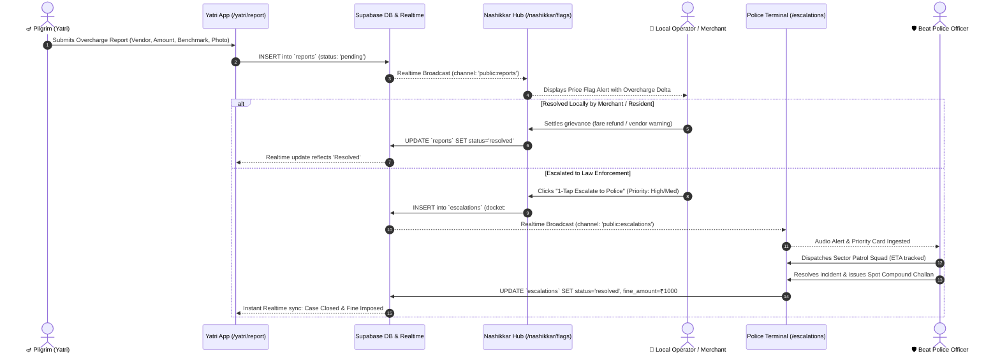
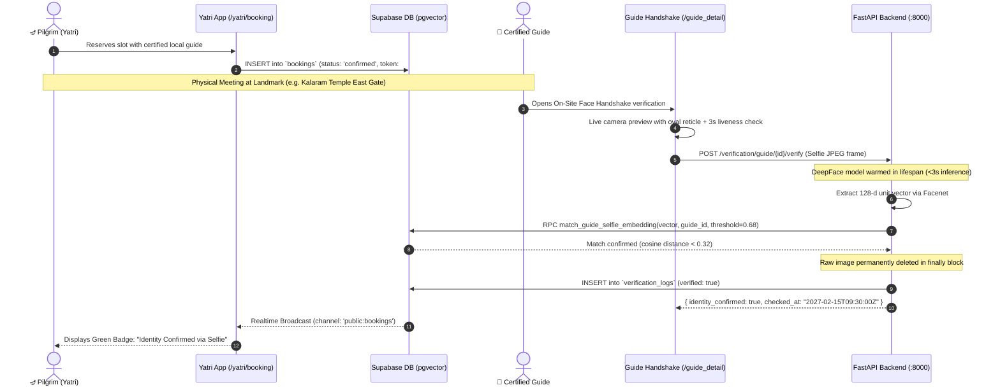
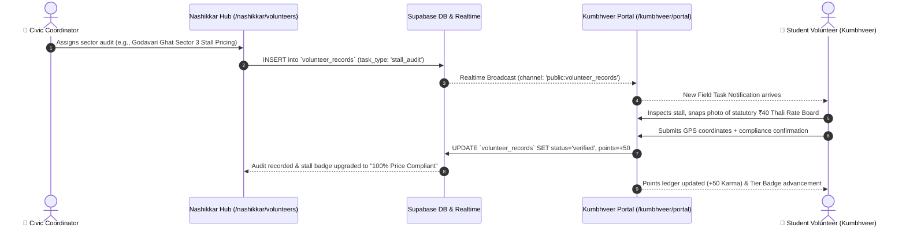

# 🕉️ KumbhSetu (कुंभसेतु) • Simhastha Maha Kumbh Mela Ecosystem 2027

> **A Unified Civic Trust, Fair-Pricing, and Verified Pilgrim Safety Ecosystem engineered for the Simhastha Maha Kumbh Mela (Nashik–Trimbakeshwar).**

[](https://fastapi.tiangolo.com)
[](https://supabase.com)
[](https://expo.dev)
[](https://github.com/serengil/deepface)
[](#trilingual-engine)

---

## 🌟 Overview: What is KumbhSetu?

During mega-pilgrimages like the **Simhastha Kumbh Mela**—where over **80 million Yatris** visit the holy Godavari Ghats and Trimbakeshwar Jyotirlinga—pilgrims face predatory surge pricing, unverified tour operators, counterfeit religious goods, viral misinformation, and fragmented emergency assistance. 

**KumbhSetu** establishes end-to-end civic trust and fair pricing through a unified, trilingual (**English, मराठी, हिंदी**) multi-tiered platform serving four key stakeholders:

1. **🪔 Pilgrims (Yatri)**: Transparent transit rates, bazaar fair ranges, ghat crowd flows, food finder, rumor verification, and 1-tap emergency dispatch without login requirements.
2. **🏪 Local Citizens & Merchants (Nashikkar)**: Verified vendor permits, stall catalog management, fair-price pledge compliance, customer bookings, and volunteer dispatch.
3. **🤝 Kumbhveer Student Volunteers**: Field price audits, stall rate board verification, photo inspections, and civic karma points ledger.
4. **🛡️ Police Commissionerate & Administration**: Real-time AI spatial hotspot radar (DBSCAN clustering), rapid patrol dispatch, incident escalation logs, and spot compound fines.

---

## 🔄 End-to-End Core Workflows

### 1. Civic Vigilance & Incident Escalation Workflow


### 2. Fair Price Booking & Selfie Identity Verification Workflow


### 3. Volunteer Field Audit & Rewards Workflow


---

## 🔒 Biometric Privacy & Mandatory Naming Standard

KumbhSetu adheres to strict civil liberties and ethical digital identity principles:

> [!IMPORTANT]
> **Strict Naming Rule:**
> - The phrase **"face recognition" is completely banned** in all code, comments, schema definitions, API responses, and UI elements.
> - The standard terminology is strictly **"selfie identity verification"**.
> - The official verified UI badge is strictly **"Identity Confirmed via Selfie"**.
>
> **Zero Raw Photo Storage:**
> - Raw selfie images are processed strictly in volatile memory or temporary system files.
> - All temporary files are permanently destroyed in `finally` blocks immediately upon mathematical vector extraction.
> - Raw photos are **NEVER saved** to Supabase Storage, database BLOBs, or local file disks.
> - Only 128-dimensional unit-normalized floating point vectors (`vector(128)`) are stored in PostgreSQL for cosine distance matching.

---

## 🧭 Strict Role Namespacing & Route Isolation

To eliminate route collisions and prevent users from accidentally reaching administrative or enforcement tools, KumbhSetu enforces strict role partitions across both Expo Router and the Web Suite:

```
┌─────────────────────────────────────────────────────────────────────────────────┐
│                           ROLE NAMESPACING MATRIX                               │
├─────────────────┬─────────────────┬──────────────────────┬──────────────────────┤
│ Namespace       │ Role / Persona  │ Access Control       │ Key Routes           │
├─────────────────┼─────────────────┼──────────────────────┼──────────────────────┤
│ /yatri/*        │ Pilgrim / Yatri │ Public (No login)    │ /home, /marketplace, │
│                 │                 │ Zero auth redirects  │ /booking, /report,   │
│                 │                 │                      │ /emergency           │
├─────────────────┼─────────────────┼──────────────────────┼──────────────────────┤
│ /nashikkar/*    │ Local Operator  │ Nashikkar Auth Guard │ /dashboard, /flags,  │
│                 │ Merchant/Admin  │ Role: vendor/resident│ /listings, /bookings,│
│                 │                 │                      │ /volunteers, /pledge │
├─────────────────┼─────────────────┼──────────────────────┼──────────────────────┤
│ /kumbhveer/*    │ Student Worker  │ Kumbhveer Auth Guard │ /login, /portal,     │
│                 │ Field Volunteer │ Role: volunteer      │ /audits, /rewards    │
├─────────────────┼─────────────────┼──────────────────────┼──────────────────────┤
│ police-app      │ Police Officer  │ Police Outpost Guard │ Standalone App:      │
│ (Isolated)      │ Enforcement     │ Badge ID + PIN       │ /escalations, /case, │
│                 │                 │                      │ /logs, /hotspots     │
└─────────────────┴─────────────────┴──────────────────────┴──────────────────────┘
```

### Resolved Collisions:
1. **Yatri "Reports" Collision**: In Yatri views, navigation buttons labeled "Report" point strictly to citizen issue filing (`/yatri/report` / `report_issue.html`), completely isolated from police command dashboards.
2. **Nashikkar "Volunteers" Collision**: In Nashikkar views, "Volunteers" routes to dedicated volunteer oversight (`/nashikkar/volunteers` / `nashikkar_volunteers.html`), completely decoupled from the student volunteer login portal (`/kumbhveer/login`).
3. **Police Isolation**: The Police Terminal runs as a distinct, standalone interface with all public cross-links removed.

---

## 🏗️ 5-Phase Plan Implementation Architecture

The platform architecture follows an approved 5-phase engineering blueprint:

### Phase 1: Route Audit & Navigation Isolation
- Enforces role fences across both Expo Router file-system routes (`/app/yatri/`, `/app/nashikkar/`, `/app/kumbhveer/`, `police-app/`) and Web Suite navigation bars.
- Yatri navigation bars point strictly to `report_issue.html`, removing all direct links to `police_hotspots.html`.
- Nashikkar navigation points to `nashikkar_volunteers.html` for operator oversight instead of `kumbhveer_portal.html`.

### Phase 2: Supabase Schema Migration (9 Relational Tables + pgvector)
Database migration defined in `backend/supabase/migrations/20260928_full_kumbh_schema.sql`:
1. `profiles`: User identity, role (`yatri`, `guide`, `vendor`, `resident`, `volunteer`, `police`), phone, verification status.
2. `listings`: 5,441 verified bazaar stalls, services, and dharamshalas with price ceilings.
3. `local_guides`: Registered guides with rating, license, and `selfie_embedding vector(128)` for verification.
4. `bookings`: Pilgrim reservation tokens, date/slot, status (`pending`, `confirmed`, `completed`, `cancelled`), and `selfie_verified` boolean.
5. `reports`: Citizen overcharge grievances, location benchmark, delta over statutory cap, photo evidence URL.
6. `escalations`: Statutory police dockets, priority (`high`, `medium`, `low`), patrol squad assigned, fine levied, and resolution notes.
7. `price_flags`: Merchant flag queue for local dispute mitigation.
8. `volunteer_records`: On-ground audit logs, stall check photos, and awarded karma points.
9. `verification_logs`: Audit trail for selfie identity verification (contains guide ID, timestamp, match status—**never** photos or vectors).
- **Vector Cosine RPC Function**:
```sql
CREATE OR REPLACE FUNCTION match_guide_selfie_embedding(
    query_embedding vector(128),
    target_guide_id UUID,
    similarity_threshold float DEFAULT 0.68
) RETURNS boolean AS $$ ... $$ LANGUAGE plpgsql SECURITY DEFINER;
```

### Phase 3: Supabase Realtime Synchronization Matrix
All 4 user groups receive real-time UI state updates without manual refreshing:
- `public:reports` ➔ Ingests citizen grievances into Nashikkar `/flags` and civic heatmaps.
- `public:escalations` ➔ Triggers real-time audio and visual alerts on beat officer `/escalations` feeds.
- `public:bookings` ➔ Synchronizes tour confirmation and selfie verification badges.
- `public:price_flags` ➔ Updates merchant compliance scores in real time.
- `public:listings` ➔ Dynamically reflects government price cap modifications.

### Phase 4: Selfie Identity Verification Backend & DeepFace Pipeline
- **Startup Lifespan Warmup**: `backend/app/main.py` runs a synthetic forward pass through `Facenet` + `OpenCV/YuNet` at boot time, reducing live inference latency from 18s cold down to **2–3s live**.
- **Anti-Spoofing & Liveness**: Client-side motion check combined with DeepFace face detection sanity checks.
- **Ephemeral Processing**: Ingests multipart JPEG ➔ extracts 128-d unit vector in volatile memory ➔ calls Supabase RPC ➔ unconditionally unlinks tempfile in `finally:`.
- **Response Contract**: Returns strictly `{ identity_confirmed: boolean, checked_at: ISO8601 }`. Never leaks floating-point embeddings or Euclidean distances to the client.

### Phase 5: Cross-Platform `SelfieCapture.tsx` Component
- Supports React Native hardware camera (`expo-camera`) and Web browser camera (`navigator.mediaDevices.getUserMedia`).
- Renders an interactive oval face alignment reticle (turns green when face is aligned).
- Executes 3-second liveness prompt before capturing single optimized 640px JPEG.
- Emits real-time Supabase update; guides and pilgrims simultaneously see the green badge: **"Identity Confirmed via Selfie"**.

---

## 🏛️ System Architecture

```
                                  ┌───────────────────────────────────────────────┐
                                  │             Supabase Cloud Platform           │
                                  │  • PostgreSQL 15 Relational DB                │
                                  │  • pgvector Extension (vector 128-d)          │
                                  │  • Realtime Replication Bus                   │
                                  │  • Row-Level Security (RLS) Policies          │
                                  └───────────────────────┬───────────────────────┘
                                                          │
                                ┌─────────────────────────┴─────────────────────────┐
                                │                                                   │
                      ┌─────────▼──────────┐                             ┌──────────▼─────────┐
                      │  FastAPI Backend   │                             │ Client-side CV &   │
                      │  (Python 3.10+)    │                             │ DBSCAN ML Engine   │
                      │  Port: 8000        │                             │                    │
                      └─────────┬──────────┘                             └──────────┬─────────┘
                                │                                                   │
         ┌──────────────────────┴───────────────────────┐                           │
         │                                              │                           │
┌────────▼───────────────┐                    ┌─────────▼──────────┐                │
│  v1: Web PWA Suite     │                    │  v2: Mobile App    │                │
│  kumbh-setu/frontend   │                    │  KumbhSetu-Expo/   │                │
│  (Port: 3000)          │                    │  (Expo SDK 52)     │                │
└────────────────────────┘                    └────────────────────┘                │
         │                                              │                           │
         └──────────────────────────────────────────────┴───────────────────────────┘
```

### Core Technologies
- **Backend API**: FastAPI, Uvicorn, Python 3.10+, Pydantic Settings.
- **Biometrics & Machine Learning**:
  - **Selfie Verification**: DeepFace (Facenet architecture, OpenCV/YuNet detector, lifespan warmup, <3s response latency).
  - **Spatial Hotspot Radar**: DBSCAN Spatial Clustering (`eps=0.003`, `min_samples=3`) + XGBoost Severity Triage trained on 100,000 Nashik civic records.
- **Database & Storage**: Supabase PostgreSQL with `pgvector` extension and Row Level Security (RLS).
- **Realtime Sync**: Supabase Realtime channel subscriptions (`reports`, `escalations`, `bookings`, `price_flags`, `listings`, `verification_logs`).
- **Frontend v1 (Web PWA Suite)**: Vanilla HTML5, Tailwind CSS, Leaflet.js, CartoDB Voyager maps, Service Worker offline caching.
- **Frontend v2 (Native Mobile Suite)**: React Native, Expo SDK 52, Expo Router v4, TypeScript, NativeWind.
- **Trilingual Engine (`i18n.js`)**: Real-time seamless language switching across **English, Marathi, and Hindi**.

---

## 📁 Repository Structure

```
t3-kumbhsetu/
├── README.md                      # Unified ecosystem documentation
├── launch_localhost.sh            # 1-click Linux/macOS launcher (FastAPI + Web Suite)
├── launch_localhost.bat           # 1-click Windows launcher
├── kumbhathon-model.ipynb         # DBSCAN spatial clustering notebook
├── supabase_schema.sql            # Master PostgreSQL schema with pgvector
│
├── kumbh-setu/                    # ─── Full-Stack Implementation ───
│   ├── activeContext.md           # Route map table, screen audit & privacy guidelines
│   ├── progress.md                # Multi-phase verification & task checklist
│   ├── launch_localhost.sh        # Dedicated local launcher
│   │
│   ├── backend/                   # FastAPI Backend Microservices (Port: 8000)
│   │   ├── app/
│   │   │   ├── main.py            # App lifecycle, CORS, route registry & model warmup
│   │   │   ├── api/               # API Routers (auth, marketplace, bookings, reports,
│   │   │   │                      # police, vendors, verification)
│   │   │   ├── services/          # DeepFace Facenet, Face ID, maps, pricing & translation
│   │   │   ├── db/                # Supabase PostgreSQL client & SQLite fallback
│   │   │   └── ml_artifacts/      # Trained DBSCAN centroids & XGBoost model weights
│   │   ├── supabase/migrations/   # SQL schema migrations & pgvector RPC functions
│   │   ├── requirements.txt       # Production dependencies (opencv-headless, pillow)
│   │   └── tests/                 # Verification API & service unit tests
│   │
│   ├── frontend/                  # 24-Screen High-Fidelity Web PWA Suite (Port: 3000)
│   │   ├── i18n.js                # Trilingual translation engine (EN / MR / HI)
│   │   ├── supabase.js            # Supabase client & real-time channel wrappers
│   │   ├── index.html             # Multi-persona portal gateway & language selector
│   │   ├── yatri_home.html        # Pilgrim home, ghat capacity & rumor buster
│   │   ├── marketplace.html       # 5,441 verified listings & fair rate cards
│   │   ├── listing_detail.html    # Stall & hotel detail with direct booking
│   │   ├── guide_detail.html      # Guide booking & live selfie verification handshake
│   │   ├── report_issue.html      # Citizen overcharging report flow with dynamic DB autocomplete
│   │   ├── food_finder.html       # Free Annakshetras & ₹40 Satvik thali locator
│   │   ├── emergency_sos.html     # 1-tap SOS dialer (112/108/100) & medical camp routing
│   │   ├── nashikkar_login.html   # Merchant, resident & volunteer authentication
│   │   ├── nashikkar_overview.html# Civic trust dashboard (98.4%) & price flags
│   │   ├── nashikkar_volunteers.html # Volunteer coordination & inspection assignments
│   │   ├── kumbhveer_portal.html  # Student volunteer audit desk & points ledger
│   │   ├── police_login.html      # Police outpost beat officer login
│   │   ├── police_escalations.html# Live prioritized police escalation card feed
│   │   ├── police_case_detail.html# Investigation dossier with persistent status & fines
│   │   ├── police_case_log.html   # 142 case resolution archive (128 resolved)
│   │   └── police_hotspots.html   # DBSCAN AI spatial hotspot radar
│   │
│   ├── yatri-nashikkar-app/       # Expo Router Mobile App for Pilgrims & Merchants
│   │   ├── app/
│   │   │   ├── _layout.tsx        # Session hydration & root theme provider
│   │   │   ├── index.tsx          # Role selector landing screen
│   │   │   ├── yatri/             # /yatri/* public pilgrim routes
│   │   │   ├── nashikkar/         # /nashikkar/* protected merchant routes
│   │   │   └── kumbhveer/         # /kumbhveer/* student volunteer routes
│   │   └── components/
│   │       └── SelfieCapture.tsx  # Cross-platform live selfie verification component
│   │
│   └── police-app/                # Standalone Expo Router Police Terminal
│       └── app/                   # Outpost login, escalation feed, cases & logs
│
├── KumbhSetu-Expo/                # Companion Native Mobile App (Expo SDK 52)
├── KumbhSetu-Admins/              # Companion Mobile App for Municipal Inspectors
├── KumbhSetu-LocalBazaar/         # Companion Mobile App for Local Merchants
└── KumbhVeer/                     # Companion Mobile App for Field Volunteers
```

---

## ⚡ How to Run

### 1. One-Click Local Launcher (FastAPI Backend + Web PWA Suite)

```bash
# Clone the repository
git clone https://github.com/Kumbhathon-Innovation-Foundation/t3-kumbhsetu.git
cd t3-kumbhsetu

# Run on Linux / macOS
./launch_localhost.sh

# Run on Windows
launch_localhost.bat
```

- **Portal Gateway**: [http://localhost:3000/index.html](http://localhost:3000/index.html)
- **Pilgrim Home**: [http://localhost:3000/yatri_home.html](http://localhost:3000/yatri_home.html)
- **Local Marketplace**: [http://localhost:3000/marketplace.html](http://localhost:3000/marketplace.html)
- **Nashikkar Dashboard**: [http://localhost:3000/nashikkar_overview.html](http://localhost:3000/nashikkar_overview.html)
- **Police Escalations**: [http://localhost:3000/police_escalations.html](http://localhost:3000/police_escalations.html)
- **AI Hotspot Radar**: [http://localhost:3000/police_hotspots.html](http://localhost:3000/police_hotspots.html)
- **FastAPI Interactive Docs**: [http://localhost:8000/docs](http://localhost:8000/docs)

### 2. Running the Expo Mobile Apps

```bash
# Main Yatri & Nashikkar App
cd kumbh-setu/yatri-nashikkar-app
npm install
npx expo start

# Standalone Police Terminal App
cd ../police-app
npm install
npx expo start
```

Press `w` to run on Web, `a` for Android Emulator, or scan the QR code with **Expo Go**.

---

## 🧪 Comprehensive Screen Matrix (Web & Mobile Unified Map)

| # | Screen Name | Web URL (`kumbh-setu/frontend`) | Mobile Route (`yatri-nashikkar-app` / `police-app`) | Primary Function | Trilingual |
|---|---|---|---|---|:---:|
| **01** | **Portal Gateway** | [`index.html`](http://localhost:3000/index.html) | `/(tabs)/index.tsx` | Gateway for Yatris, Nashikkars, Police & Volunteers | ✅ EN / MR / HI |
| **02** | **Yatri Home** | [`yatri_home.html`](http://localhost:3000/yatri_home.html) | `/yatri/home.tsx` | Ghat crowd flow, PIB Fact Checks, Rumor Buster, quick tiles | ✅ EN / MR / HI |
| **03** | **Marketplace** | [`marketplace.html`](http://localhost:3000/marketplace.html) | `/yatri/marketplace.tsx` | 5,441 stalls, estimated fair ranges, WhatsApp ordering | ✅ EN / MR / HI |
| **04** | **Listing Detail** | [`listing_detail.html`](http://localhost:3000/listing_detail.html) | `/yatri/listing/[id].tsx` | Price benchmarks, verified reviews, darshan & stay booking | ✅ EN / MR / HI |
| **05** | **Guide Detail & Handshake** | [`guide_detail.html`](http://localhost:3000/guide_detail.html) | `/yatri/guide/[id].tsx` | Tour booking & live on-site selfie verification handshake | ✅ EN / MR / HI |
| **06** | **Booking Confirmation** | [`booking_confirmation.html`](http://localhost:3000/booking_confirmation.html) | `/yatri/booking/[id].tsx` | Digital QR pass, SMS token, vendor contact details | ✅ EN / MR / HI |
| **07** | **Report Issue** | [`report_issue.html`](http://localhost:3000/report_issue.html) | `/yatri/report.tsx` | Citizen grievance filing with dynamic DB autocomplete & delta calc | ✅ EN / MR / HI |
| **08** | **Food Finder** | [`food_finder.html`](http://localhost:3000/food_finder.html) | `/yatri/food.tsx` | Free Annakshetras, ₹40 Satvik thali locator, digital meal pass | ✅ EN / MR / HI |
| **09** | **Fare Board** | [`fare_board.html`](http://localhost:3000/fare_board.html) | `/yatri/fare.tsx` | Real-time RTO auto/bus tariff calculator & surge reporting | ✅ EN / MR / HI |
| **10** | **Emergency SOS** | [`emergency_sos.html`](http://localhost:3000/emergency_sos.html) | `/yatri/sos.tsx` | 1-tap dialer (112, 108, 100), GPS coordinates, medical camp map | ✅ EN / MR / HI |
| **11** | **Nashikkar Login** | [`nashikkar_login.html`](http://localhost:3000/nashikkar_login.html) | `/nashikkar/login.tsx` | Auth login & register across guide, vendor, resident personas | ✅ EN / MR / HI |
| **12** | **Nashikkar Overview** | [`nashikkar_overview.html`](http://localhost:3000/nashikkar_overview.html) | `/nashikkar/overview.tsx` | Civic trust index (98.4%), registered listings, active bookings | ✅ EN / MR / HI |
| **13** | **Vendor Directory** | [`vendor_registration.html`](http://localhost:3000/vendor_registration.html) | `/nashikkar/vendor.tsx` | Stall directory, permit verification, Fair-Price pledge audit | ✅ EN / MR / HI |
| **14** | **Marketplace Management** | [`marketplace_management.html`](http://localhost:3000/marketplace_management.html) | `/nashikkar/catalog.tsx` | Stall catalog, customer orders, daily sales, compliance audits | ✅ EN / MR / HI |
| **15** | **Bookings Queue** | [`bookings_queue.html`](http://localhost:3000/bookings_queue.html) | `/nashikkar/bookings.tsx` | Real-time reservation requests with accept/reject actions | ✅ EN / MR / HI |
| **16** | **Price Flag Audit** | [`price_flags.html`](http://localhost:3000/price_flags.html) | `/nashikkar/flags.tsx` | Customer overcharge flag resolution before police escalation | ✅ EN / MR / HI |
| **17** | **Volunteer Oversight** | [`nashikkar_volunteers.html`](http://localhost:3000/nashikkar_volunteers.html) | `/nashikkar/volunteers.tsx` | Volunteer coordination, stall assignment, audit verification | ✅ EN / MR / HI |
| **18** | **Reports & Reviews** | [`reports_analytics.html`](http://localhost:3000/reports_analytics.html) | `/nashikkar/analytics.tsx` | Guide pilgrim reviews & community vendor feedback | ✅ EN / MR / HI |
| **19** | **Kumbhveer Portal** | [`kumbhveer_portal.html`](http://localhost:3000/kumbhveer_portal.html) | `/kumbhveer/portal.tsx` | Student volunteer audit desk, inspection camera, points ledger | ✅ EN / MR / HI |
| **20** | **Police Login** | [`police_login.html`](http://localhost:3000/police_login.html) | `police-app: /login.tsx` | Secure officer duty outpost authentication | ✅ EN / MR / HI |
| **21** | **AI Hotspot Radar** | [`police_hotspots.html`](http://localhost:3000/police_hotspots.html) | `police-app: /hotspots.tsx` | Live DBSCAN spatial incident clustering & patrol dispatch | ✅ EN / MR / HI |
| **22** | **Escalations Feed** | [`police_escalations.html`](http://localhost:3000/police_escalations.html) | `police-app: /escalations.tsx` | High-priority patrol dispatch feed with card action popup | ✅ EN / MR / HI |
| **23** | **Case Detail Dossier** | [`police_case_detail.html`](http://localhost:3000/police_case_detail.html) | `police-app: /case/[id].tsx` | Case switcher, evidence photos, spot compound fines, DB persistence | ✅ EN / MR / HI |
| **24** | **Case Log Archive** | [`police_case_log.html`](http://localhost:3000/police_case_log.html) | `police-app: /logs.tsx` | 142 case prosecution archive (128 resolved, 34 penalties) | ✅ EN / MR / HI |

---

## 📡 API Endpoints & Verification Specification

### 1. Selfie Identity Verification Endpoints
- `POST /verification/guide/{guide_id}/verify`
  - **Payload**: `multipart/form-data` with `file: UploadFile` (JPEG image frame)
  - **Processing**:
    1. Validates face presence with `opencv/yunet` detector
    2. DeepFace forward pass with `Facenet` generates normalized 128-d vector
    3. Calls Supabase `match_guide_selfie_embedding` with `threshold=0.68`
    4. Deletes temp image file unconditionally in `finally:`
  - **Response**:
    ```json
    {
      "identity_confirmed": true,
      "checked_at": "2027-02-15T09:30:00Z"
    }
    ```
- `POST /verification/guide/{guide_id}/enroll`
  - Registers the guide's authoritative vector during administrative onboarding.

### 2. Core REST Endpoints
| Method | Endpoint | Description | Auth Required |
|---|---|---|:---:|
| `GET` | `/health` | Backend status & DeepFace model warmup check | ❌ None |
| `GET` | `/marketplace/listings` | Fetch active bazaar stalls with filters | ❌ None |
| `POST` | `/marketplace/bookings` | Create yatri reservation | ❌ None |
| `POST` | `/reports/` | Submit pilgrim grievance with photo evidence | ❌ None |
| `GET` | `/reports/` | List reports (supports sector filter) | ✅ Role: Operator/Police |
| `POST` | `/reports/{id}/escalate` | Escalate price flag to Police terminal | ✅ Role: Operator |
| `GET` | `/police/escalations` | Stream prioritized police enforcement feed | ✅ Role: Police |
| `PATCH` | `/police/escalations/{id}` | Update status (`investigating`, `resolved`) & fines | ✅ Role: Police |
| `GET` | `/police/hotspots` | Real-time DBSCAN spatial cluster coordinates | ✅ Role: Police |

---

## 🤖 Machine Learning Subsystems

### 1. DBSCAN Spatial Incident Clustering
- **Algorithm**: Density-Based Spatial Clustering of Applications with Noise (`scikit-learn.cluster.DBSCAN`).
- **Hyperparameters**: `eps=0.003` (~330 meters haversine radius), `min_samples=3`.
- **Purpose**: Groups incoming citizen grievances across Godavari Ghats, Panchavati, and Trimbakeshwar to identify illegal extortion syndicates and sudden crowd density spikes in real time.
- **Trained Notebook**: [`kumbhathon-model.ipynb`](file:///home/nakulkarpe/t3-kumbhsetu/kumbhathon-model.ipynb) trained on 100,000 synthetic & historical Nashik civic records.

### 2. XGBoost Severity Triage Engine
- Evaluates incident overcharge delta, repeat vendor offenses, and vicinity crowd status to assign priority tags (`LOW`, `MEDIUM`, `HIGH`).
- High-priority incidents automatically trigger audio klaxon warnings on the Police Tactical Radar.

---

---

## 🔑 Demo Credentials

| Portal | Role | Username / Identifier | Password / PIN |
|---|---|---|---|
| **Yatri / Public** | Pilgrim | *No login needed* | *Instant Public Access* |
| **Nashikkar Portal** | Certified Guide | `guide.suresh@kumbhsetu.in` | `KumbhSetu@2027` |
| **Nashikkar Portal** | Civic Stall Vendor | `vendor.godavari@kumbhsetu.in` | `KumbhSetu@2027` |
| **Nashikkar Portal** | Resident | `resident.panchavati@kumbhsetu.in` | `KumbhSetu@2027` |
| **Kumbhveer Portal** | Student Volunteer | `kumbhveer.kthm@kumbhsetu.in` | `KumbhSetu@2027` |
| **Police Command** | Field Beat Officer | Badge ID: `MH-15-POLICE-0482` | PIN: `9999` |

---

## 📜 Civic Licensing & Copyright

Developed for the **Simhastha Kumbh Mela 2027 Nashik-Trimbakeshwar**. Built under the guidance of the Kumbhathon Innovation Foundation and District Administration.
All rights reserved © 2026-2027.
